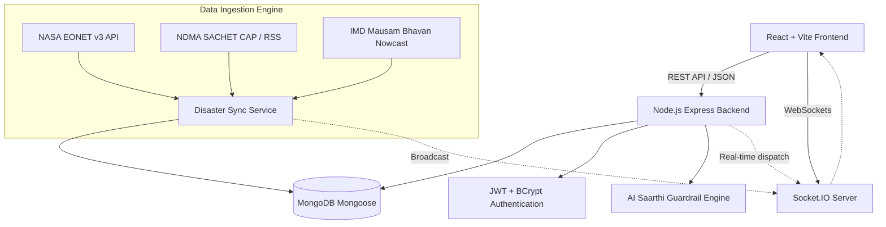

# SevaSaarthi Product Requirements Document (PRD)

## 1. Executive Summary
**SevaSaarthi** is an integrated civic emergency, healthcare access, and disaster mitigation platform engineered for Indian citizens, first responders, and civic authorities. It combines multi-agency early warning feeds (NDMA SACHET CAP, IMD Mausam Bhavan, NASA EONET v3) with local disaster management, Kumbh Mela crowd safety, Jan Aushadhi generic medicine discovery, and 112 emergency dispatch.

---

## 2. System Architecture

---

## 3. Core Modules & Capabilities

### 3.1 Disaster Early Warning & Multi-Feed Telemetry
- **NASA EONET v3:** Open, near-real-time natural event tracking for landslides, cyclones, wildfires, and floods.
- **NDMA SACHET CAP / RSS:** India's Common Alerting Protocol feed with ETag caching (`If-None-Match`, 304 handling) for high-bandwidth resilience.
- **IMD Mausam Bhavan:** Nowcast weather warnings, thunderstorm alerts, and riverine basin flood advisories.
- **Deduplication:** Incidents are uniquely indexed by `incidentId` and updated with timestamp tracking.

### 3.2 112 Emergency SOS & SLA Triage
- Generates structured incident identifiers (`SS-EMG-YYYY-XXXXX`).
- Real-time SLA response timer with automatic magistrate escalation on SLA breach.
- Multi-agency routing: Police, 108 ALS Ambulance, SDRF, Fire Brigade.

### 3.3 Healthcare & Jan Aushadhi Generic Discovery
- Geospatial 2dsphere proximity search for 24x7 verified hospitals and ICU beds.
- Pradhan Mantri Jan Aushadhi generic catalog with brand matching and up to 75% price comparison.
- Duty doctor roster and OPD teleconsultation booking.

### 3.4 Kumbh Mela & Mass-Gathering Safety
- Sector-wise crowd density telemetry (Sangam Ghat, Parade Ground, Pontoon Bridges).
- Integrated Lost & Found registry broadcasting alerts across CCTV and NDRF helpdesks.

### 3.5 Volunteer Logistics
- Community response battalion tracking with skill tagging (First Aid, Boat Rescue).
- Prescription and flood relief delivery tracking.

### 3.6 AI Saarthi Clinical Guardrails
- Automatic detection of life-threatening red-flag keywords (chest pain, snake bite, breathing distress).
- Enforces strict non-prescriptive civic advice disclaimers.
- Bilingual support in Hindi and English.
